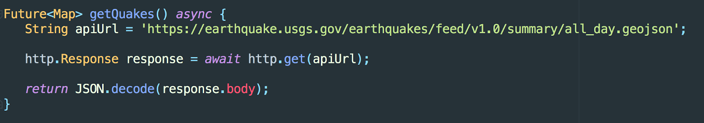
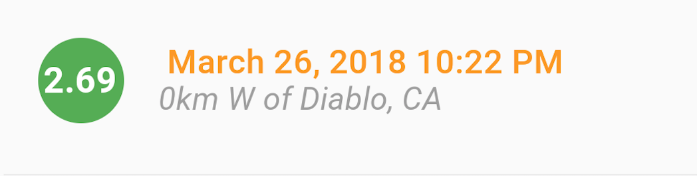
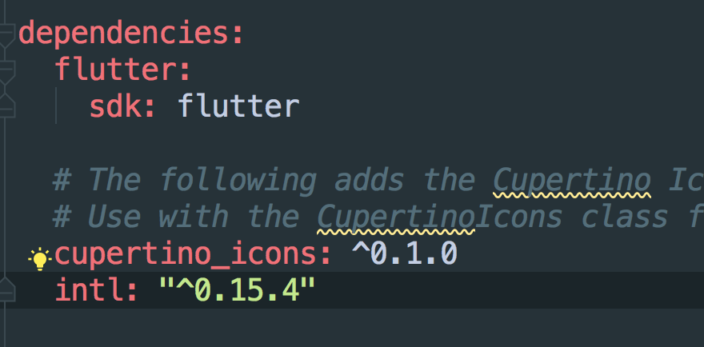
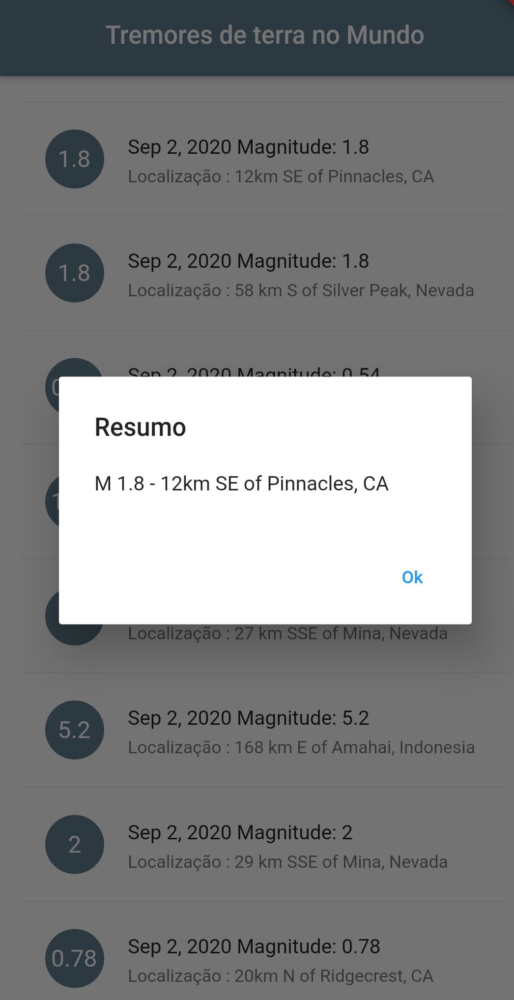
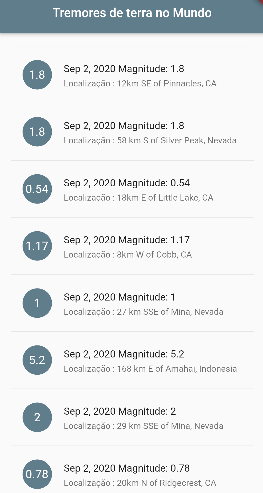

<h3 align="center">
    
    
</h3>

  </a>
   <a href="https://github.com/gabrielbcsilva">
   
 

  </a>

  
 
  

## App Terremotos Globais(realTime) utilizando Api open source

- [Sobre](#sobre)
- [Tecnologias utilizadas](#tecnologias-utilizadas)
- [Passo a Passo](#passo-a-passo)
- [Como contribuir](#como-contribuir)

## :interrobang: Sobre

Uma _App_ que mostra os tremores de terra diários que ocorreram no Mundo(Magnitude, data e localização) usando uma Api gratuita os valores são atualizados diariamente, o json processado vem em formato de "mapa" ou "dicionário", para ficar mais fácil a vizualização da árvore utilizo o <a href="http://jsonviewer.stack.hu">Online Json View </a>.

## :diamonds: Tecnologias utilizadas

O projeto foi desenvolvido utilizando as seguintes tecnologias:

- [Flutter](https://flutter.dev/docs)

## -"Bônus" Passo a Passo de Como fiz
Para completar o exercício eu precisei do:

O endereço JSON API URL

Você vai usar USGS API que pode encontrar aqui: https://earthquake.usgs.gov/earthquakes/feed/v1.0/summary/all_day.geojson

Abra-o no seu browser ou no site que eu recomendei para analise da arvore

     2. Crie um projeto Flutter com todos os recursos necessários para começar a codar.

     3. Recursos, Imagens - Neste exercício não precisará de imagens

     

**Nota 1**: O JSON começa com  “{“;  o que significa que você tem que fazer com que a função que vai processa-la seja do tipo mapa.

Veja o exemplo seguinte:

**Nota 2**: Ainda mais, dando uma olhada á nossa  JSON tree, você nota que o que se quer é o campo features cuja ela é do tipo List porque temos  “[“.  Então, você terá que ter cuidado ao analizar essa parte do JSON.  Aqui está um exemplo:

 List _features = _dados[‘features’]; // features  tipo List

 
**Nota 3**: Para conseguir tirar uma data que possa ser lida por usuários como na foto em baixo:

_Passo 1_

Instalar o Intl plugin. Siga esse link para mais instruções: https://pub.dartlang.org/packages/intl#-installing-tab-

_Passo 2_:

Multiplicar o campo “time” que recebe do API por 1000 para converte-lo em milisegundos, o que é a unidade necessária para que possamos converter para um formato legível.  Saiba mais: https://stackoverflow.com/questions/45357520/dart-converting-milliseconds-since-epoch-unix-timestamp-into-human-readable

Também, você deverá usar a classe DateFormat para ter uma data legível.   Saiba mais sobre datas etc: https://www.dartdocs.org/documentation/intl/0.15.1/intl/DateFormat-class.html

Como você já deve ter apercebido, se quiser ter uma data num formato Português e não o formato padrão Inglês, você terá que ainda fazer um outro passo.

Saiba mais aqui: https://pub.dartlang.org/packages/intl

- Resultado : 

## :dart: Como contribuir

- Faça um _Fork_ deste repositório;
- Crie uma _branch_ com a sua feature: `git checkout -b my-feature`
- _Commit_ suas mudanças: `git commit -m 'feat: My new feature'`
- Faça um _push_ da sua branch: `git push origin my-feature`